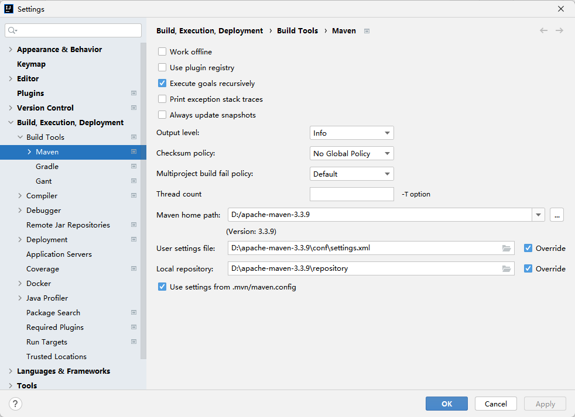
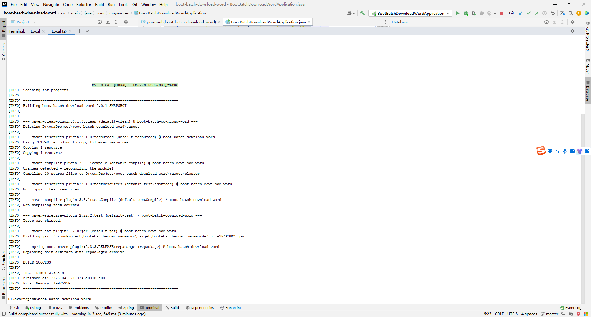
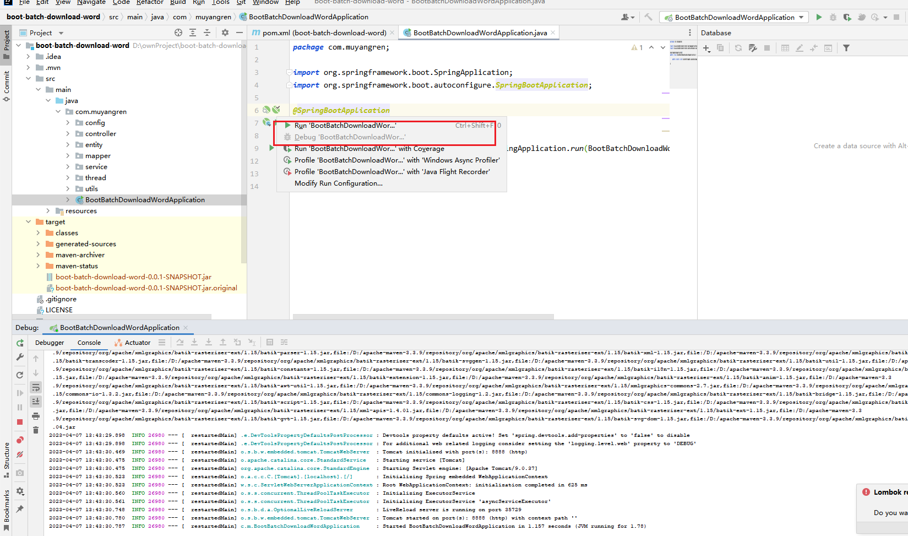
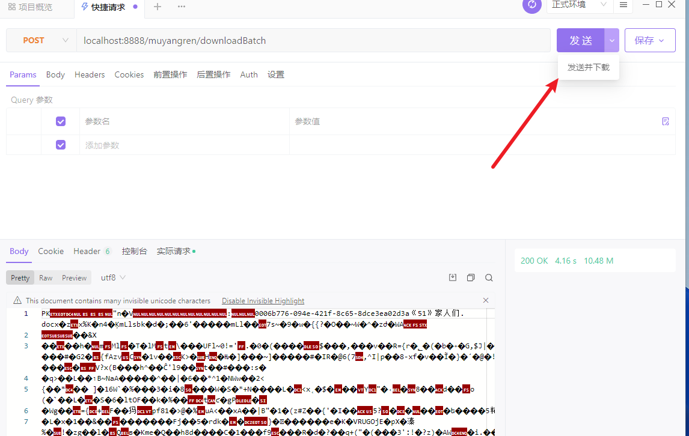
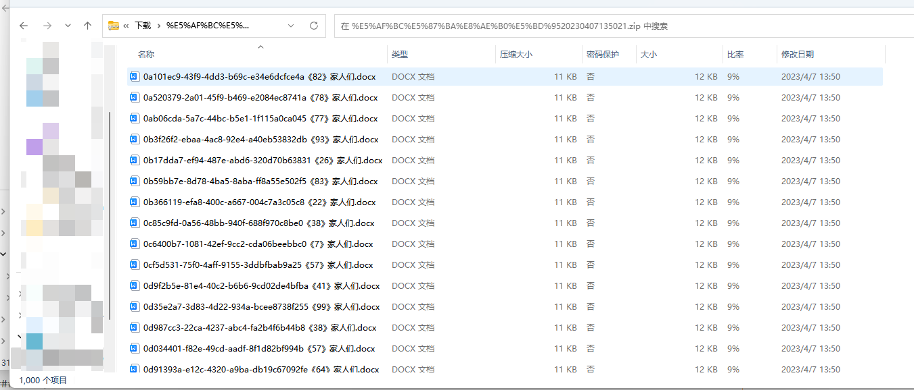

# boot-batch-download-word

#### 介绍
！解决导出nginx超时问题
1、使用CountDownLatch+Runnable去优化批量下载问题,优化springboot批量下载word打包zip并通过浏览器下载的操作
2、提供实际项目模板案例、修改对应参数即可。
3、考虑到测试项目、应该是一键启动、就不集成mybatis-plus（虽然模板有用到）这里自行集成哈
4、提升的是下载速度、通过浏览器输出该慢还是慢、可以考虑加进度条忽悠下用户

#### 启动说明
1. 先配置jdk和maven

2. 打开控制台执行命令：mvn clean package -Dmaven.test.skip=true

3. 启动单体项目

#### 启动说明
由于没有集成swagger文档、这是可自行使用apifox或者postman测试
接口：localhost:8888/muyangren/downloadBatch  选择发送并下载

#### 结果

