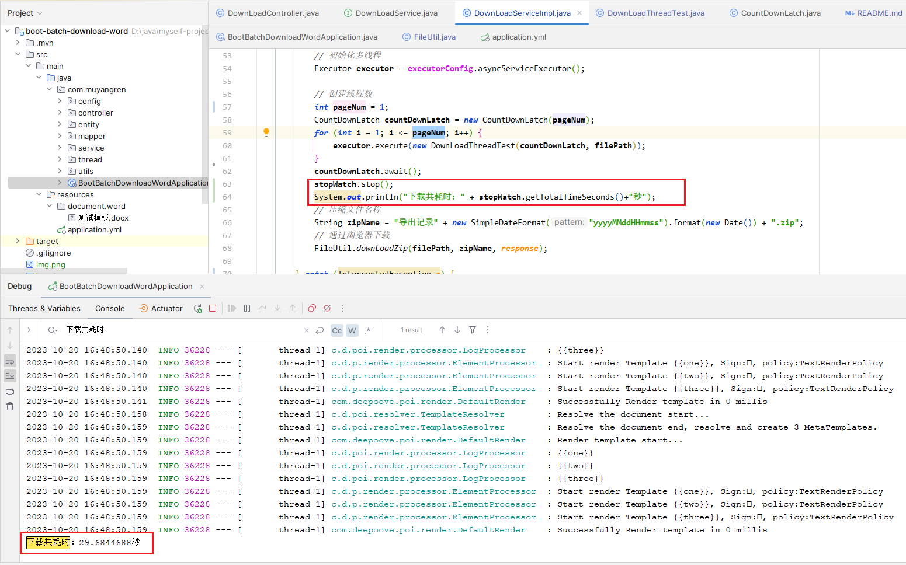

# boot-batch-download-word java利用多线程批量下載文档

# 项目介绍
* 解决批量导出文档耗时过长导致nginx报超时问题(一般来说，nginx配置超时时间60s)
* 使用CountDownLatch+Runnable去优化批量下载问题,优化批量下载word打包zip并通过浏览器下载的操作
* 提供实际项目模板案例、修改对应参数即可
* 考虑到测试项目、应该是一键启动、就不集成mybatis-plus（虽然代码有用到）这里自行集成
* 注意：提升的是下载文档速度,如果压缩包过大，输出到浏览器的速度还是会慢

# 启动说明
1. 配置jdk maven仓库
2. 打开控制台执行命令：mvn clean package -Dmaven.test.skip=true
3. 启动BootBatchDownloadWordApplication

4. 使用测试工具，例如api-fox或者postman,
接口：localhost:8888/muyangren/downloadBatch 选择发送并下载

# 结果对比
## 修改application.yml參數

## 单线程处理1000份文档
> 结果为大概在30秒上下

## 多线程线程处理1000份文档
> 2条线程同时处理1000份文档 大概在20秒上下

> 3条线程同时处理1000份文档 大概在16秒上下

> 4条线程同时处理1000份文档 大概在15秒上下(博主的笔记本极限了)

## 总结
提升还是有的，数据量越大效果会更明显，这里只处理了1000份数据,单线程也才用了30秒
但是要考虑到实际响应情况，如果太多请求长时间未响应，是会拖垮服务的，所以批量下载使用多线程还是有必要的
> 如果觉得有帮助麻烦点个星支持下
